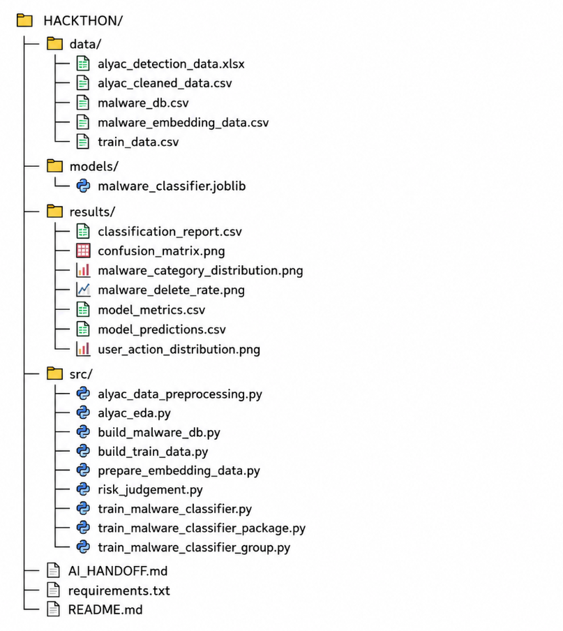

# 닿음 데이터 파이프라인

## 1. 개요

본 데이터 파이프라인은 알약 모바일 악성코드 탐지 로그 10,000건을 기반으로
닿음 서비스의 악성 앱 탐지 DB와 ML 분류 모델, AI/RAG 연동용 데이터를 구축하기 위해 작성되었습니다.

전체 흐름은 다음과 같습니다.

원본 탐지 로그
→ 데이터 전처리 및 EDA
→ 탐지 DB 구축
→ 악성코드 분류 모델 검증
→ AI/RAG 임베딩 데이터 생성

## 2. 주요 데이터 처리 결과

### 원본 데이터
- 원본 데이터: 10,000건
- 전체 컬럼: 22개
- malware_package 결측: 1,465건 (14.65%)

탐지 DB에서는 패키지명이 실제 앱 식별 및 매칭에 사용되므로,
malware_package가 없는 데이터는 탐지 DB 구축 대상에서 제외했습니다.

### 악성코드 유형 분포
주요 클래스는 다음과 같습니다.

- Riskware
- Adware
- Trojan
- Monitor
- Spyware
- Misc

Riskware 비중이 가장 높아 클래스 불균형이 존재합니다.

## 3. 주요 파일

### alyac_cleaned_data.csv

원본 알약 탐지 로그를 전처리한 데이터입니다.

주요 컬럼:

- malware_name
- malware_package
- malware_category
- user_action

### malware_db.csv

서비스의 실제 악성 앱 탐지에 사용하는 DB입니다.

주요 컬럼:

- malware_name
- malware_package
- malware_category

패키지명 또는 악성코드 진단 정보를 기반으로 알려진 악성 앱을 조회하는 데 사용합니다.

### train_data.csv

악성코드 유형 분류 모델 학습 및 검증용 데이터입니다.

모델의 목표는 악성 앱 정보를 기반으로 다음 유형을 분류할 수 있는지 검증하는 것입니다.

- Riskware
- Adware
- Trojan
- Monitor
- Spyware
- Misc

### malware_embedding_data.csv

AI/RAG 담당자에게 전달하는 임베딩용 데이터입니다.

컬럼:

- record_id
- malware_name
- malware_package
- malware_category
- search_text

search_text는 Pinecone 등 Vector DB에 저장하기 위한 임베딩 입력용 텍스트입니다.

## 4. 서비스 탐지 로직

서비스의 위험 판정은 ML 분류 결과만으로 결정하지 않습니다.

### HIGH
패키지명 또는 식별 정보가 기존 탐지 DB와 정확히 일치하는 경우

→ 알려진 위험 앱

### MEDIUM
Exact Match는 없지만 Vector DB 검색 결과 유사도가 기준 이상인 경우

→ 추가 확인이 필요한 앱

### UNKNOWN
Exact Match 및 유사도 기준을 만족하지 않는 경우

→ 현재 데이터에서 확인되지 않은 앱

중요:

UNKNOWN은 '안전'을 의미하지 않습니다.

현재 데이터셋에서 확인할 수 없다는 의미이며,
미등록 앱을 임의로 정상 앱이라고 판단하지 않습니다.

## 5. ML 모델 검증

### [실험 1] malware_name + package

Accuracy: 100%
Macro F1: 100%

하지만 malware_name에 Adware, Trojan, Riskware 등의
정답 카테고리 정보가 포함되어 있어 Data Leakage 가능성을 확인했습니다.

따라서 해당 결과를 최종 성능으로 사용하지 않았습니다.

### [실험 2] Package Only + Random Split

Accuracy: 96.13%
Macro F1: 91.30%

malware_name을 입력에서 제거하고 package만 사용했습니다.

하지만 동일 package가 Train/Test에 동시에 존재할 가능성이 있어
실제 미등록 앱에 대한 일반화 성능보다 과대평가될 가능성이 있었습니다.

### [실험 3] Package Group Split

동일한 malware_package가 Train/Test에 동시에 존재하지 않도록 분리했습니다.

- 전체 데이터: 8,527건
- 고유 Package: 2,521개
- Train/Test 중복 Package: 0개
- Test 고유 Package: 505개

최종 결과:

- Accuracy: 86.83%
- Macro F1: 50.41%

주요 클래스 F1:

- Riskware: 90.94%
- Adware: 82.93%
- Trojan: 55.95%
- Spyware: 22.22%
- Misc: 0%

Riskware와 Adware에서는 비교적 높은 성능을 보였지만,
데이터 수가 적은 소수 클래스에서는 성능 저하를 확인했습니다.

## 6. ML 모델 활용 원칙

ML 모델은 서비스의 최종 위험 판정을 직접 수행하지 않습니다.

실험을 통해 미등록 Package에 대한 분류 가능성을 확인했지만,
클래스 불균형 및 소수 클래스 일반화 성능의 한계도 확인했습니다.

따라서 닿음에서는

탐지 DB Exact Match
→ Vector DB 유사도 검색
→ AI 설명

구조를 우선 사용하고,

ML 분류 모델은 미등록 앱에 대한
보조 분석 및 향후 확장 가능성을 검증하는 용도로 활용합니다.

## 7. 모델 관련 산출물

### model_metrics.csv

최종 모델의 핵심 성능 지표

- Accuracy
- Macro F1

### classification_report.csv

악성코드 유형별

- Precision
- Recall
- F1-score
- Support

결과를 저장한 파일입니다.

### confusion_matrix.png

실제 악성코드 유형과 모델 예측 결과를 비교한 Confusion Matrix입니다.

### model_predictions.csv

테스트 데이터별

- malware_package
- 실제 category
- 예측 category
- 정답 여부

를 저장한 파일입니다.

### malware_classifier.joblib

학습된 악성코드 유형 분류 모델입니다.

## 8. AI/RAG 담당 연동 방법

AI/RAG에서는 malware_embedding_data.csv를 사용합니다.

권장 처리 흐름:

1. 사용자 기기의 앱 package 확인
2. malware_db에서 Exact Match 검색
3. Exact Match 존재 → HIGH
4. Exact Match 없음 → Vector DB 유사도 검색
5. 유사도가 기준 이상 → MEDIUM
6. 기준 미만 → UNKNOWN
7. 탐지 결과 및 관련 정보를 LLM에 전달
8. 사용자에게 이해하기 쉬운 위험 설명 및 대응 방법 생성

중요:

Vector Search는 Exact Match를 대체하지 않습니다.

정확한 Package Match를 우선 수행한 후,
검색되지 않는 앱에 대해서만 유사도 검색을 보조적으로 사용합니다.

## 9. 전체 파일 구조

## 10. 데이터 담당 핵심 결론

단순히 높은 Accuracy를 확보하는 것을 목표로 하지 않았습니다.

초기 100% 성능에서 데이터 누수 가능성을 발견하고,
입력 변수를 재설계한 뒤 Package 단위 Group Split으로 검증 방법을 강화했습니다.

그 결과 미등록 Package 기준 Accuracy 86.83%, Macro F1 50.41%를 확인했으며,
소수 클래스의 한계를 고려해 ML 모델을 최종 위험 판정이 아닌 보조 분석 수단으로 설계했습니다.